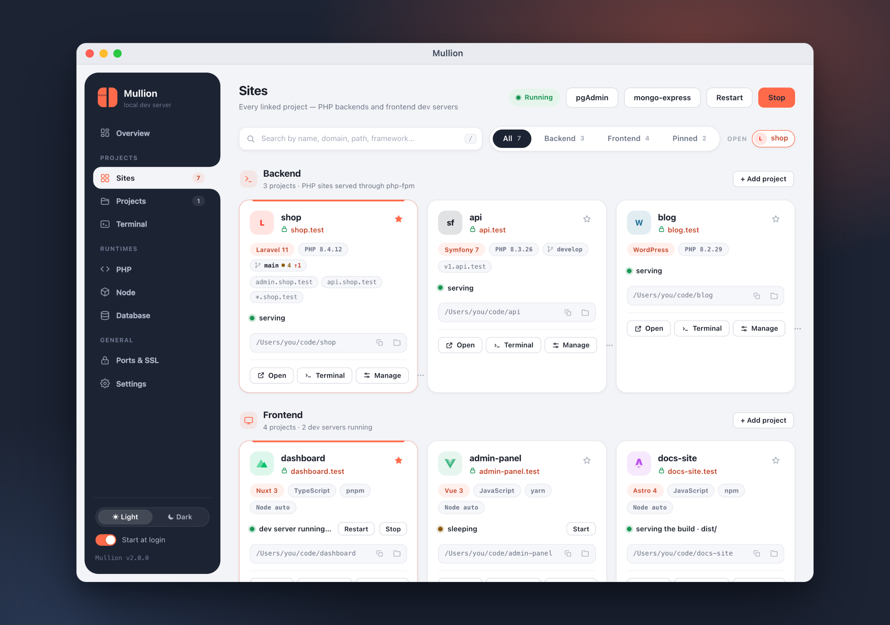
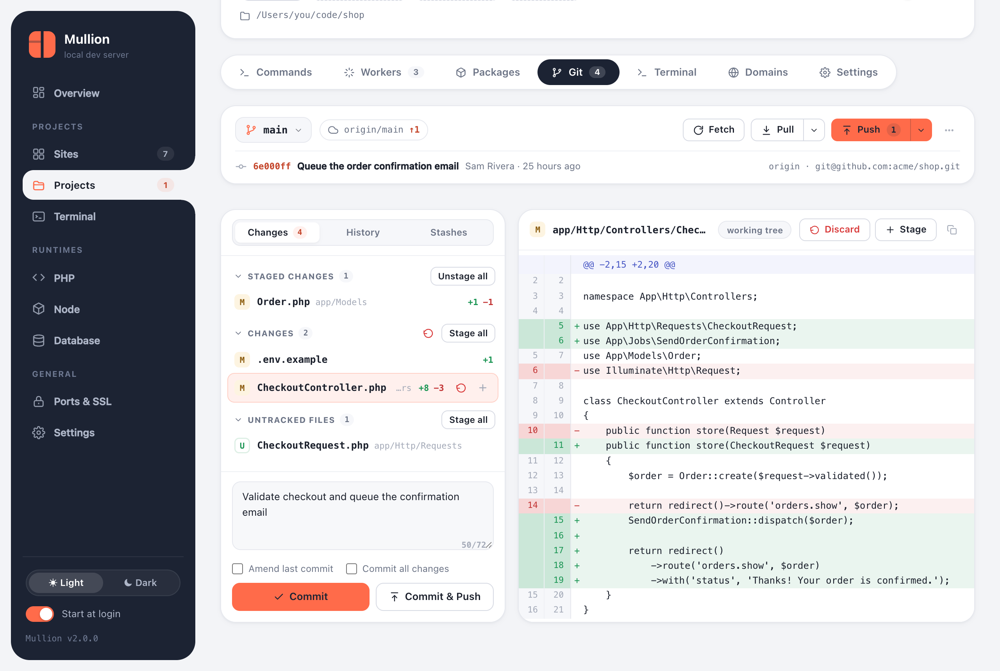
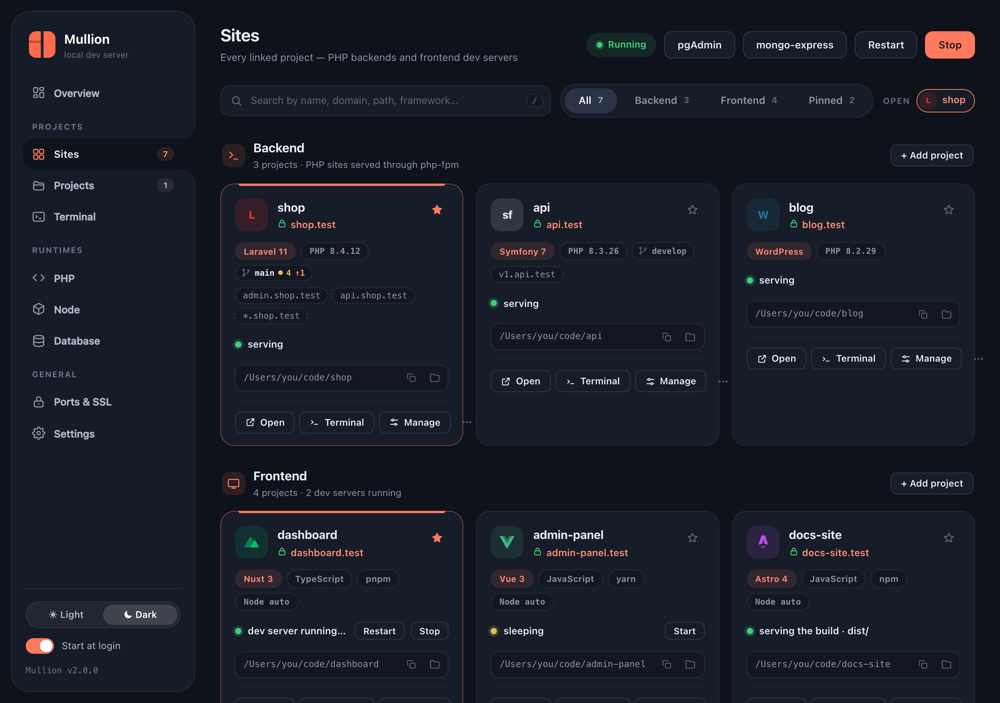
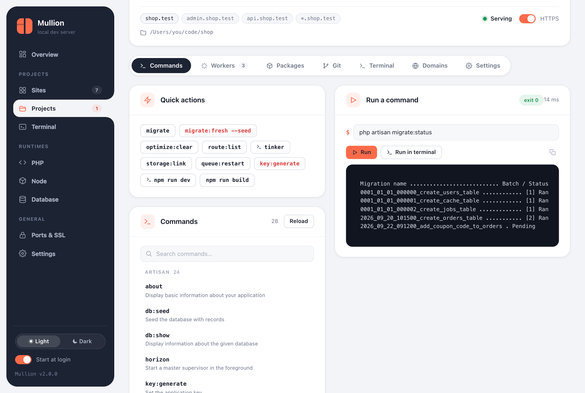
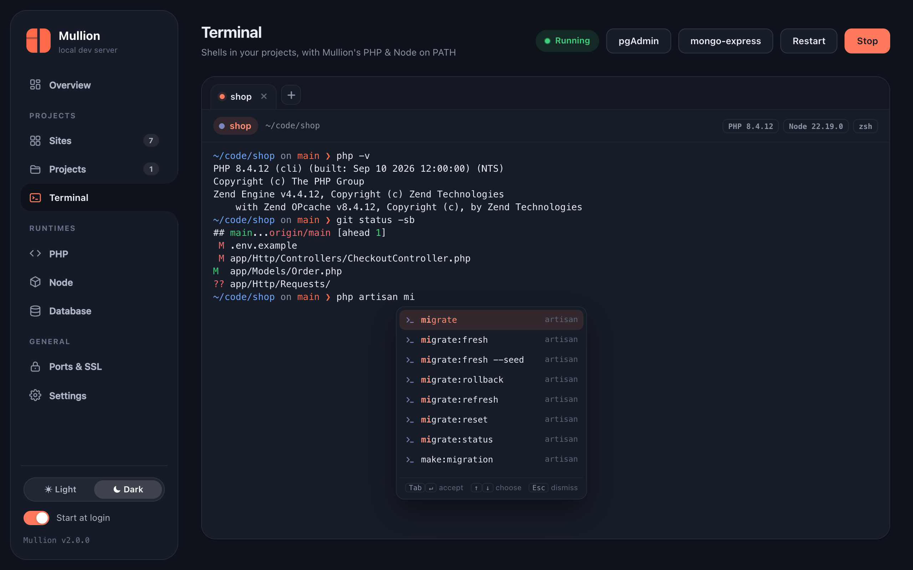
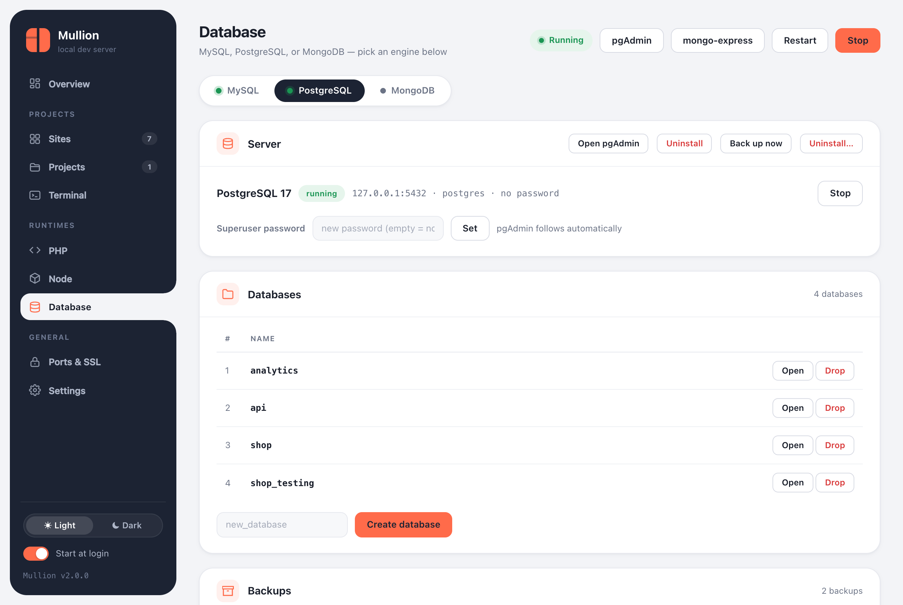
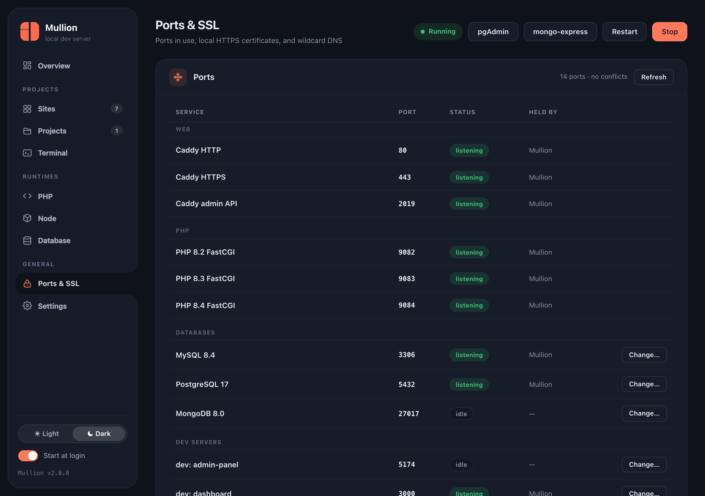

<p align="center">
  <picture>
    <source media="(prefers-color-scheme: dark)" srcset="docs/assets/brand/mullion-logo-dark.svg">
    
  </picture>
</p>

<p align="center">
  <strong>A zero-setup local development environment for Windows and macOS.</strong><br>
  PHP and Node projects on <code>.test</code> domains with trusted HTTPS, plus MySQL, PostgreSQL and MongoDB, all from one binary.
</p>

<p align="center">
  <a href="https://github.com/anabiiil/mullion/releases/latest"></a>
  
  <a href="LICENSE"></a>
</p>

<p align="center">
  <a href="https://anabiiil.github.io/mullion/"><b>Website &amp; docs</b></a> ·
  <a href="#install">Install</a> ·
  <a href="#quick-start">Quick start</a> ·
  <a href="#command-reference">Commands</a> ·
  <a href="CHANGELOG.md">Changelog</a>
</p>

<p align="center">
  
</p>

```
cd ~/code/shop       && mullion link   →  https://shop.test
cd ~/code/storefront && mullion link   →  https://storefront.test
```

For each project, Mullion picks the right PHP or Node version and serves
it on a `.test` domain with a padlock. It runs your frontend's dev server
for you and puts it to sleep when you stop using it. Commands, queue
workers, Git and a terminal for each project are all in one control panel.

## Why Mullion

- **One file, no dependencies.** You don't need Docker, a VM, Homebrew
  services or config files. `mullion setup` installs the whole stack into
  one folder (`~/.mullion` or `C:\Mullion`), and `mullion uninstall`
  removes it cleanly.
- **Backends and frontends are equal.** Laravel, Symfony and WordPress
  sit next to Nuxt, Next.js, Vue, React, Svelte and Astro. Each project
  gets its own domain and its own runtime version.
- **Opening the link starts the project.** Frontend dev servers start
  when you open their link and go to sleep when you're done.
- **Everything is visible.** You can see which process holds each port,
  which PHP and Node a folder gets and why, and run `mullion doctor` for
  a full diagnosis.

## Features

**Sites and domains**
- `mullion link` in any folder serves it at `https://<folder>.test`.
  Mullion detects the project type.
- Trusted local HTTPS through [Caddy](https://caddyserver.com) and its
  local certificate authority.
- Subdomain aliases (`api.shop.test`) and wildcards (`*.shop.test`),
  which use Mullion's built-in DNS server.
- The Sites page shows every project as a card with its framework,
  version, Git branch, domains and status, with search, filters and
  pinning.

**A page for every project**
- **Commands**: artisan, `bin/console`, Composer and npm scripts, run with
  live output. You can mark favorites.
- **Workers**: queue workers, the scheduler, Horizon, Reverb, Messenger or
  any custom command. Mullion supervises them and restarts them if they
  crash.
- **Packages**: search Packagist and npm, then install or remove
  packages.
- **Git**: diff, stage, commit, pull, push, branches, history and stashes.
- **Terminal**, **Domains** and **Settings** tabs.

**Runtimes**
- PHP versions side by side, set globally or per project. Extension
  toggles, a php.ini editor, and Composer.
- Node versions set globally, per project, or from `.nvmrc`, with an npm
  version picker for each one.
- Managed dev servers with wake-on-demand, idle sleep, and a switch
  between dev and build.

**Databases**
- MySQL/MariaDB, PostgreSQL and MongoDB, each installed, started and
  stopped on its own.
- phpMyAdmin, pgAdmin 4 and mongo-express, already connected.
- Backups and restore, with a backup offered before anything destructive.

**Apps**
- **Mullion.app** on macOS: a native window with window tabs. On
  Windows, the panel opens in its own app window, with a tray icon.
- Light and dark themes.

<p align="center">
  
</p>

## Install

Download the latest release from
**[Releases](https://github.com/anabiiil/mullion/releases/latest)**: a
single file with nothing else to install.

### macOS (Homebrew)

```bash
brew tap anabiiil/tap
brew trust anabiiil/tap   # newer Homebrew versions ask for this once for third-party taps
brew install mullion
mullion setup
```

Or run one command, without Homebrew:

```bash
curl -fsSL https://raw.githubusercontent.com/anabiiil/mullion/main/install.sh | sh
```

Or download `mullion-<version>-darwin-arm64.tar.gz` (Apple Silicon) or
`-darwin-amd64.tar.gz` (Intel) from Releases, then:

```bash
tar -xzf mullion-*-darwin-*.tar.gz
xattr -c ./mullion   # clear the quarantine flag Gatekeeper puts on downloads
./mullion setup
```

### Windows (Scoop)

```powershell
scoop bucket add mullion https://github.com/anabiiil/scoop-bucket
scoop install mullion
mullion setup
```

Or download `mullion.exe` from Releases, double-click it, and answer
**Run setup now?** with Y. Windows SmartScreen may warn about the
unsigned exe the first time: click **More info → Run anyway**.

### What setup does

`mullion setup` installs the following:

- It creates the install folder: `~/.mullion` on macOS, `C:\Mullion` on
  Windows.
- It downloads Caddy and puts `mullion` on your `PATH`.
- It installs the latest PHP (made the default), Composer, and Node LTS
  with npm.
- It installs MySQL, running on `127.0.0.1:3306` as `root` with no
  password.
- It serves phpMyAdmin at `https://phpmyadmin.test`.
- On macOS it puts **Mullion.app** in `/Applications`; on Windows it adds
  a desktop shortcut.

It asks for your password (or one UAC prompt) once, to trust the local
certificate and to edit the hosts file. If it finds another stack
(Laragon, XAMPP, a Homebrew service), it offers to take over and imports
that stack's databases first. Every finished step is skipped on a re-run,
so running setup again is always safe. **Open a new terminal
afterwards.**

## Quick start

```bash
cd ~/code/shop          # a Laravel app: public/ is detected
mullion link            # → http://shop.test
mullion secure          # → https://shop.test

cd ~/code/storefront    # a Next.js / Vite / Nuxt app
mullion link --secure   # → https://storefront.test (dev server managed for you)
```

Open the control panel with **Mullion.app** (macOS) or with:

```bash
mullion ui
```

Useful next steps:

```bash
mullion isolate 8.2                 # pin this project to PHP 8.2
mullion node isolate 20             # pin its Node version (or use .nvmrc)
mullion alias shop add api          # api.shop.test
mullion worker add shop --name Queue --kind queue \
  --command "php artisan queue:work --tries=3" --autostart
mullion run shop -- php artisan migrate
mullion postgres install            # PostgreSQL 17, initialized and running
```

## Sites and the project page

The **Sites** page shows every linked project as a card. Each card has
the framework and major version (Laravel, Symfony, WordPress, Nuxt,
Next.js, Vue, React, Svelte, Astro, …), the language, the package
manager, the PHP or Node version, the Git branch, and every domain the
site answers on. You can search, filter by Backend, Frontend or Pinned,
pin favorites, copy a path, or show a project in Finder or Explorer. Open
several projects as tabs, or pop one out into its own window.

<p align="center">
  
</p>

Click a project's name to open its page:

| Tab | What it does |
|---|---|
| **Commands** | Artisan / `bin/console` commands, Composer and npm scripts, with quick actions and favorites. Runs them with live output, or in a terminal for interactive ones. |
| **Workers** | Background processes that Mullion supervises: queue workers, `schedule:work`, Horizon, Reverb, Messenger, anything custom. Autostart with the stack; after a crash, a restart with backoff (1s → 60s); logs in `~/.mullion/logs/`. |
| **Packages** | Search Packagist and the npm registry, then install (optionally as dev) or remove. |
| **Git** | See [Git](#git). |
| **Terminal** | A shell in the project folder with the project's PHP and Node. |
| **Domains** | Add subdomain aliases and the `*` wildcard; frontend sites can also change their dev-server port here. |
| **Settings** | PHP or Node version for this site, dev/build mode, HTTPS, rename, and unlink. |

<p align="center">
  
</p>

### Frontend dev servers

Link a project that has a `dev` script and Mullion runs it for you with
npm, pnpm or yarn, picked from the lockfile. It installs
dependencies on the first run and proxies the domain to the dev server,
with HMR and websockets working.

- **Wake on demand.** Opening the link of a stopped site shows a short
  *Starting…* page, then your app. If the server fails to start, the page
  shows the real error and the end of the log.
- **Idle sleep.** A site with no open tab sleeps after 2 minutes. A site
  with an idle open tab sleeps after 10 minutes; requests and code edits
  reset that clock.
- **Dev or build.** `mullion serve build` serves the last production
  build instead, and builds it if there isn't one yet.

## Terminal

The built-in terminal (xterm.js) has tabs and opens in the project folder
with the project's own PHP, Node and Composer first on `PATH`, even when
the project is pinned to a version other than the global one. As you
type, it suggests paths, commands, npm and Composer scripts, artisan
commands, and Git branches; Tab or Enter accepts a suggestion. In
Settings you choose where terminals open: the Terminal page, a separate
window, or the project page.

<p align="center">
  
</p>

### Mullion Terminal (optional)

[Mullion Terminal](https://github.com/anabiiil/mullion-terminal) is a
standalone terminal app with tabs, a folder sidebar, learned command
suggestions and open-in-editor buttons. On first launch the panel asks
which terminal you want; pick Mullion Terminal and it downloads and
installs it for you (about 100 MB). After that, the panel's Terminal
buttons open the project folder as a new tab in Mullion Terminal. Switch
back, install, or update it under Settings → Terminal. The Terminal tab
on a project's page always uses the built-in terminal, and commands the
panel types for you (Composer, artisan) still run there.

```bash
mullion terminal install   # install or update it, and make it your terminal
mullion terminal myapp     # open a site (or a folder) in it
```

It is built for Apple-silicon Macs and 64-bit Windows.

## Git

Every project has a Git tab. It covers:

- **Status and diff**: staged, unstaged and untracked files, a
  side-by-side diff, and stage/unstage/discard for single files or all of
  them.
- **Committing**: commit or amend, or "Commit & Push" in one step.
- **Syncing**: fetch, then pull by merge, rebase or fast-forward only.
  Push, publish a new branch, or push with `--force-with-lease`.
- **Branches, history and stashes**: create, switch and delete branches;
  browse history; manage stashes.
- **Conflicts**: a banner appears during a merge or rebase with
  conflicts, with the actions to continue or abort.

Pushing over SSH uses your normal Git and SSH setup (see
[FAQ](#faq--troubleshooting) if your key has a passphrase).

## Databases and backups

The Database page has a tab for each engine. Each engine installs,
starts and stops independently, and an engine you stopped stays stopped.

| Engine | Default | Admin tool | CLI |
|---|---|---|---|
| MySQL (or MariaDB) | 8.4 LTS on `127.0.0.1:3306`, user `root` | phpMyAdmin at `https://phpmyadmin.test` | `mullion mysql`, `mullion db`, `mullion mariadb` |
| PostgreSQL | 17 on `127.0.0.1:5432`, user `postgres` | pgAdmin 4 (a server is registered already) | `mullion postgres` (`pg`) |
| MongoDB | 8.0 on `127.0.0.1:27017` | mongo-express at `https://mongo.test` | `mullion mongo`, `mullion mongo-express` |

- **Backups.** The panel's **Back up now** button, or `mullion mysql
  backup`, `mullion postgres backup` and `mullion mongo backup`, write a
  timestamped folder. On macOS the default folder is `~/.mullion-Backups`, outside the install
  folder so it survives an uninstall; you can change it in Settings.
  Restore or delete backups from the panel, or use
  `mullion <engine> restore`.
- **Uninstalling** an engine offers a backup first. Switching MySQL
  versions migrates your databases automatically.

<p align="center">
  
</p>

## PHP and Node

- **PHP:**
  - `mullion php install 8.3`, `mullion use 8.4` for the global version,
    or `mullion isolate 7.4` for one project.
  - Each version runs its own FastCGI worker on its own port (8.3 → 9083).
  - Extensions: Windows toggles any extension and downloads PECL ones
    (`mullion php ext get redis`). The macOS builds are static, from
    [static-php.dev](https://static-php.dev), with the common extensions
    compiled in; OPcache and APCu can be toggled.
  - On macOS the LDAP extension is built from source when a version is
    installed. This needs the Xcode Command Line Tools.
  - The php.ini editor covers memory limit, upload and post size,
    execution and input time, input vars, errors, timezone, and OPcache
    timestamps. Use it in the panel or with `mullion php ini set
    memory_limit 512M`.
- **Node:**
  - `mullion node install 22`, `mullion node use 22`, or
    `mullion node isolate 20`.
  - `node`, `npm` and `npx` resolve for each folder: the project's pinned
    version, then `.nvmrc`, then the default.
  - `mullion node which` explains why a folder gets its version.
  - `mullion node npm 10 22` changes the npm version inside a Node
    install.
  - Dev servers and project commands trust Mullion's local CA
    (`NODE_EXTRA_CA_CERTS`).

## Ports, SSL and wildcard DNS

The **Ports & SSL** page (`mullion ports`) lists every port Mullion uses,
whether it's listening, and which process holds it, and it flags
conflicts. From that page (or the CLI) you can:

- **Change ports**: move a database (`mullion port set postgres 5433`) or
  a dev server (`mullion port dev storefront 3005`), with conflict
  detection.
- **Manage certificates**: re-trust the local CA (`mullion ssl trust`),
  export it for Firefox, phones or VMs (`mullion ssl export ca.crt`), or
  switch every site to HTTPS (`mullion ssl all on`).
- **Turn on wildcard DNS** with `mullion dns on`. This is needed only for
  `*` aliases, because the hosts file can't do wildcards. On macOS it adds
  `/etc/resolver/<tld>`, which points at Mullion's DNS server on port
  53535. On Windows it adds an NRPT rule for `.<tld>`, which needs port
  53 free.

<p align="center">
  
</p>

## Command reference

Run `mullion <command> --help` for flags and examples. The
[CLI reference](https://anabiiil.github.io/mullion/docs/cli.html) on the
website has the full help text.

| Command | What it does |
|---|---|
| `mullion setup` | First-time setup: PATH, Caddy, latest PHP + Composer + Node LTS + MySQL + phpMyAdmin |
| `mullion start` / `stop` / `restart` / `status` | Control the whole stack / show what's running |
| `mullion ui` | Open the control panel |
| `mullion app` | Install Mullion.app into Applications (macOS) |
| `mullion doctor` | Diagnose the whole stack (paste the output when reporting a problem) |
| `mullion link [name]` | Serve the current directory at `<name>.test` (`--secure`, `--php`, `--build`, `--dir`) |
| `mullion unlink` / `links` / `rename [old] <new>` | Remove, list or rename sites |
| `mullion secure` / `unsecure [name]` | HTTPS with a locally-trusted certificate / back to HTTP |
| `mullion alias <site> add\|remove\|list [sub]` | Extra subdomains (`api.shop.test`), or `*` for all |
| `mullion dns on\|off\|status` | Wildcard DNS for `*.<tld>` |
| `mullion tld [tld]` | Show or change the domain suffix for all sites |
| `mullion serve dev\|build [name]` | Choose what a frontend domain serves |
| `mullion dev start\|stop\|restart [name]` | Control a site's managed dev server |
| `mullion run [site] -- <cmd…>` | Run a command in a site's folder with its PHP and Node |
| `mullion worker add\|list\|start\|stop\|restart\|logs\|remove` | Manage a site's background workers |
| `mullion pkg search\|list\|add\|remove` | Composer/npm packages for a linked site |
| `mullion php install\|list\|available\|uninstall` | Manage PHP versions |
| `mullion use <v>` / `isolate <v>` / `unisolate` | Global PHP / pin one project / unpin |
| `mullion php ext list\|enable\|disable\|get` | PHP extensions (PECL downloads on Windows) |
| `mullion php ini [v]` / `php ini set <key> <value>` | Show or set curated php.ini settings |
| `mullion composer install [v]` | Install or update Composer |
| `mullion node install\|use\|list\|available\|uninstall` | Manage Node versions |
| `mullion node isolate\|unisolate\|which` | Pin a project's Node / unpin / explain resolution |
| `mullion node npm <npm> [node]` | Change the npm bundled with a Node install |
| `mullion mysql install\|start\|stop\|password\|restore\|uninstall` | Manage MySQL |
| `mullion mariadb [v]` | Switch the database server to MariaDB |
| `mullion db list\|create\|drop` | MySQL databases |
| `mullion postgres install\|start\|stop\|status\|password\|backup\|restore\|uninstall` | Manage PostgreSQL (alias `pg`) |
| `mullion postgres db list\|create\|drop` | PostgreSQL databases |
| `mullion mongo install\|start\|stop\|status\|backup\|restore\|uninstall` | Manage MongoDB |
| `mullion mongo db list\|create\|drop` | MongoDB databases |
| `mullion backups` | List database backups |
| `mullion phpmyadmin [v]` / `pgadmin` / `mongo-express` | Install/open the admin tools (each has `uninstall`) |
| `mullion heidisql` | HeidiSQL desktop client (Windows) |
| `mullion ports` | Ports Mullion uses, who holds them, conflicts |
| `mullion port set <engine> <port>` / `port dev <site> <port>` | Move a database or a dev server to another port |
| `mullion ssl` / `ssl trust` / `ssl export <file>` / `ssl all on\|off` | The local certificate authority and HTTPS for all sites |
| `mullion autostart [on\|off]` | Start Mullion when you sign in |
| `mullion tray` | Windows notification-area icon |
| `mullion uninstall` | Remove everything (offers a database backup first; your projects are untouched) |

## Requirements

- **macOS** 12 or newer, on Apple Silicon or Intel. The Command Line
  Tools are needed only to build PHP's LDAP extension.
- **Windows** 10 or 11, 64-bit. Setup installs the Microsoft VC++ runtime
  if it's missing.
- Administrator rights once during setup, to edit the hosts file and
  trust the local certificate.

## Uninstall

```bash
mullion uninstall
```

This stops every service and removes the install folder, the hosts-file
entries, the `PATH` entries, the trusted root certificate, the autostart
entry and Mullion.app. First it offers to export every database to a
backup folder that is kept. **Your project folders are never touched.**
Then remove the package itself with `brew uninstall mullion` or
`scoop uninstall mullion` if you installed that way.

## FAQ & troubleshooting

**Something's off. Where do I start?**
Run `mullion doctor`. It checks the binary, ports and who owns them,
Caddy, PHP, Node, the databases, the wake agent and every site, and it
marks each problem with its fix. Paste the output when you open an issue.

**Why does linking a site ask for my password?**
New domains are written to the hosts file, inside a marked block that
Mullion manages. Writing there needs administrator rights. From a
terminal you get a `sudo` prompt; from the panel you get the system
password dialog on macOS or UAC on Windows.

**My browser says the certificate isn't trusted.**
Run `mullion ssl trust` (or use **Trust again** on the Ports & SSL page).
Firefox, phones and VMs keep their own trust stores: export the CA with
`mullion ssl export ~/mullion-ca.crt` and import it there.

**`php -v` or `node -v` shows a different version.**
Another install comes earlier on your `PATH`: Laragon or XAMPP on
Windows, nvm or Homebrew on macOS. `mullion use` and `mullion node use`
detect this and offer to fix it; then open a new terminal.
`mullion node which` explains exactly what resolves and why.

**A Vite or Next app shows the error page, or its port is taken.**
The error page shows the real reason and the end of the log. If the dev
server's port is taken, pick another one with `mullion port dev <site>
<port>` or from the Ports & SSL page. Mullion proxies the `.test` domain
to whatever port the server actually opened.

**`git push` from the panel fails for an SSH remote.**
The panel can't type a key passphrase for you. Add the key to your agent
once (`ssh-add --apple-use-keychain ~/.ssh/id_ed25519` on macOS, or run
the OpenSSH Authentication Agent service on Windows), or push once from
the built-in terminal, which can prompt you.

**Wildcard subdomains don't resolve.**
`*` aliases need `mullion dns on`. `mullion dns status` shows whether the
resolver hookup and the DNS server are in place. On Windows, port 53 must
be free.

## Contributing & building from source

Requirements: Go (see `go.mod`); on macOS, the Xcode Command Line Tools
for the app and brand assets.

```bash
go build -trimpath -o dist/mullion .                                        # this platform
GOOS=windows GOARCH=amd64 go build -trimpath -o dist/mullion.exe .          # Windows
go test ./...
```

- `bash macapp/build.sh` builds Mullion.app (a Swift/AppKit shell around
  the panel) as a universal binary and packages it for the Go binary to
  embed. Rebuild `mullion` afterwards so `mullion app` and setup can
  install it.
- `bash tools/brand/build.sh` regenerates every raster brand asset: the
  panel favicon, the Windows `.ico`, and the `.syso` resources (icons plus
  the version info from `versioninfo.json`, so bump that file with
  `internal/version` and rerun the script). It runs on Windows too; only
  the macOS app icon needs a Mac (Swift), and it is skipped elsewhere.
- The binary is deliberately not stripped (`-ldflags "-s -w"`), because
  stripped Go executables trip antivirus heuristics more often.
- The website lives in [`docs/`](docs/): plain HTML, CSS and JavaScript
  with no build step, served by GitHub Pages.

Issues and pull requests are welcome. Please include `mullion doctor`
output with bug reports.

## License

[MIT](LICENSE) © 2026 Abdelrahman Nabil
